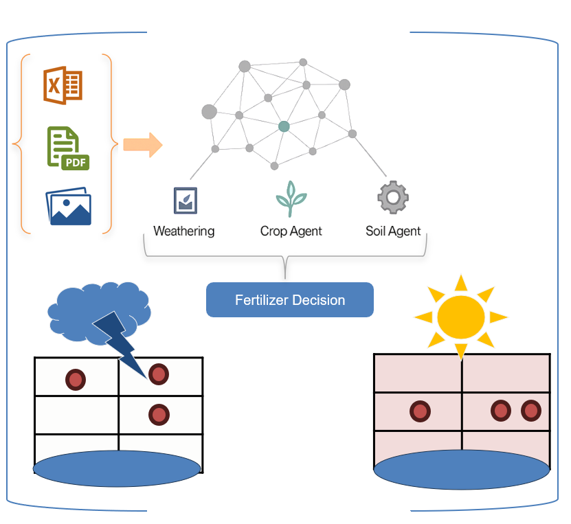
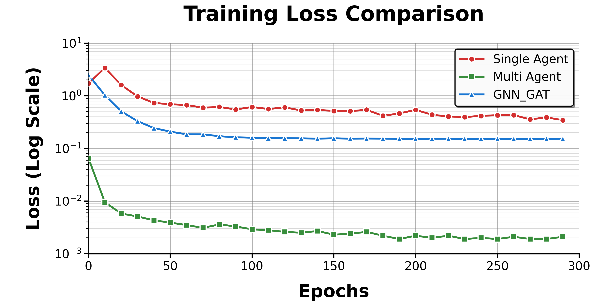

# KG-F: Knowledge Graph-Based Multi-Agent System for Fertilizer Optimization

<div align="center">
  
</div>

**KG-F** (formerly KG-F) is a cutting-edge explainable AI system for precision agriculture that leverages knowledge graphs and multi-agent learning to provide optimal fertilizer recommendations. Our framework integrates heterogeneous agricultural data and employs specialized Graph Attention Networks (GATv2) to capture complex soil-crop-weather interactions for dynamic, context-aware decision-making.

---

## Key Modules

- **Neo4j Knowledge Graph**: Stores soil, crop, fertilizer, and weather information as structured nodes and semantic relationships with domain-specific schema alignment
- **Multi-Agent GNN Architecture**: Specialized GATv2 agents for each domain (soil, crop, weather) with sophisticated attention-based coordination
- **Post-hoc Explainability**: Comprehensive symbolic and LLM-based reasoning (Llama 3) to interpret predictions with natural language explanations
- **Real-Time Adaptation**: Edge deployment capability for dynamic field condition response

---

## Project Structure

```
KG-MASFO/
├── Codes/
│   ├── train_multi_agent.py    # Multi-agent training pipeline
│   ├── kg_construction.py      # Knowledge graph building
│   ├── explanation_module.py   # Symbolic explainability
│   ├── evaluate_model.py       # Model evaluation
│   └── gnn_models.py          # GATv2 implementations
├── DataFiles/
│   ├── soil_data.csv          # USDA soil characteristics
│   ├── crop_data.csv          # NASS crop information
│   ├── weather_data.csv       # Visual Crossing weather
│   └── fertilizer_data.csv    # EDI fertilizer treatments
├── DumpFile/                  # Neo4j database exports
├── PaperDraft/               # Research paper and figures
├── Presentation/             # Conference slides and visual pipeline diagrams
├── README.md                 # This file
└── requirements.txt          # Python requirements
```

---

## Quick Start

### 1. Install Dependencies
```bash
pip install -r requirements.txt
```

### 2. Launch Neo4j and Load KG
- **Option 1**: Open Neo4j Desktop, create a DB, and import from `DumpFile/*.dump`
- **Option 2**: Use `Codes/populate_neo4j.py` to load from CSVs in `DataFiles/`

### 3. Train the Model
```bash
python Codes/train_multi_agent.py
```

### 4. Evaluate and Visualize
```bash
python Codes/evaluate_model.py
```

### 5. Interactive Fertilizer Inference
```bash
python Codes/train_multi_agent.py --interactive
```

---

## System Workflow

### KG Construction
- **Input**: Heterogeneous structured CSVs (soil, crop, weather, fertilizer)
- **Process**: Schema mapping and semantic alignment with typed nodes and edges
- **Output**: Neo4j KG with domain-specific relationships and agricultural ontology

### 👥 Multi-Agent Architecture
- **SoilAgent**: pH, nutrient content, texture, organic matter analysis
- **WeatherAgent**: Temperature, humidity, precipitation, seasonal patterns
- **CropAgent**: Growth stage, variety, health indicators, nutrient requirements
- **Fusion**: MetaAgent uses attention mechanisms to weight domain-specific embeddings

### Explainability Pipeline
- **Feature Attribution**: Gradient-based importance scoring
- **Symbolic Rule Extraction**: Domain-specific threshold mappings
- **Template Generation**: Structured explanation framework
- **LLM Enhancement**: Natural language refinement via Llama 3

---

## Experimental Results

### Comprehensive Model Comparison

| Classifier | Accuracy (↑) | F1 Score (↑) | No Fert. Acc. (↑) | Fert. Acc. (↑) | R² (↑) | MSE (↓) |
|------------|--------------|--------------|-------------------|----------------|--------|---------|
| **Traditional ML** |
| SVM | 0.6512 | 0.6341 | 0.7143 | 0.5909 | 0.0194 | 0.2450 |
| GB | 0.6296 | 0.6970 | 0.4074 | 0.8519 | 0.0419 | 0.2395 |
| MLP | 0.6111 | 0.6316 | 0.5556 | 0.6667 | 0.0257 | 0.2436 |
| KNN | 0.6047 | 0.6047 | 0.6190 | 0.5909 | 0.0138 | 0.2464 |
| LR | 0.5846 | 0.5846 | 0.5938 | 0.5758 | 0.0158 | 0.2460 |
| DT | 0.5741 | 0.5818 | 0.5556 | 0.5926 | 0.0252 | 0.2437 |
| XGBoost | 0.5581 | 0.5778 | 0.5238 | 0.5909 | 0.0138 | 0.2464 |
| RF | 0.5370 | 0.5763 | 0.4444 | 0.6296 | 0.0175 | 0.2456 |
| GNB | 0.5185 | 0.5938 | 0.3333 | 0.7037 | 0.0014 | 0.2497 |
| **Graph Neural Networks** |
| GNN-GAT | 0.7285 | 0.7313 | 0.7567 | 0.7100 | 0.7865 | 0.0162 |
| Single-Agent | 0.8476 | 0.8477 | 0.9304 | 0.7798 | 0.8700 | 0.0230 |
| **KG-F (Ours)** | **0.8991** | **0.8977** | **0.9472** | **0.7896** | **0.9685** | **0.0024** |

### Training Dynamics

<div align="center">
  
</div>

> **Training Loss Comparison**: KG-F achieves fastest convergence and lowest final loss of 0.002, representing:
> - **99.4% improvement** over Single-Agent (final loss: 0.34)
> - **98.7% improvement** over GNN-GAT (final loss: 0.15)
> - **75x better performance** than traditional approaches

---

## Example Output

```yaml
Predicted Fertilizer Recommendation (kg/ha):
  pH: 6.4
  Nitrogen: 22.7
  Phosphorous: 18.3
  Potassium: 31.2
  Calcium: 15.8
  Magnesium: 8.7
  NH4: 12.4
  NO3: 18.9

Confidence Score: 0.94
```

**Explanation**:  
Soil→acidic pH (5.8), low NO3 (12 mg/kg) × Weather→humid (22%), cool (15°C) × Crop→reproductive stage  
**Recommendation**:  
"Agent 1 detects acidic pH and nitrogen deficiency, requiring soil amendment. Agent 2 notes cold stress and low humidity, indicating slow nutrient uptake. Agent 3 identifies reproductive phase requiring increased nutrition. Collaborative inference recommends 47.2 kg/ha nitrogen application with lime addition for pH correction."

---

## 📡 Data Sources

| Source | Description | 
|--------|-------------|
| **USDA Web Soil Survey** | Comprehensive soil characteristics |
| **Visual Crossing Weather** | Real-time meteorological data | 
| **EDI Data Portal** | Fertilizer treatment records | 
| **NASS Crop Data** | Crop development and statistics | 
---

## Model Architecture

### Technical Specifications
- **Agents**: GATv2 + Residual connections + TransformerConv layers
- **Fusion**: Multi-head attention mechanism with layer normalization
- **Loss Function**: Smooth L1 Loss for robust regression
- **Optimization**: AdamW with early stopping (patience=40 epochs)
- **Target Nutrients**:
```python
["pH", "Nitrogen", "Phosphorous", "Potassium", "Calcium", "Magnesium", "NH4", "NO3"]
```

### Hyperparameter Configuration
| Component | Parameter | Value |
|-----------|-----------|-------|
| GATv2 Agent | Hidden dimension (per head) | 32 |
| GATv2 Agent | Number of heads | 4 |
| GATv2 Agent | Output embedding dimension | 64 |
| Fusion MLP | Input dimension | 192 (3 agents × 64) |
| Fusion MLP | Hidden layers | [256, 128, 64] |
| Optimization | Learning rate | 5 × 10⁻⁴ |
| Optimization | Weight decay | 1 × 10⁻⁴ |

---

## Performance Metrics

| Metric | Value |
|--------|-------|
| **Overall Accuracy** | 89.91% |
| **R² Score** | 0.9685 |
| **Mean Squared Error** | 0.0024 |
| **F1 Score** | 0.8977 |
| **Explanation Coverage** | 100% |
| **Inference Time** | ~0.2s (CPU) |
| **Convergence Speed** | 75x faster than baselines |

---

## Citation

If you use KG-F in your research, please cite our paper:

```bibtex
@article{abuzaid2025kgmasfo,
  title={KG-F: A Knowledge Graph Framework for Fertilizer Recommendation},
  author={Abu Zaid, Nahed and Chintalapati, Jaya Shruti and Chirkova, Rada and Vatsavai, Ranga Raju and Shah, Mihir},
  journal={Conference Proceedings},
  year={2025},
  institution={North Carolina State University},
  address={Raleigh, North Carolina, USA}
}
```

---

## Research Team

**Researcher**: Nahed Abu Zaid (naabuzai@ncsu.edu)  
**Advisor**: Prof. Ranga Raju Vatsavai (rrvatsav@ncsu.edu)  
*Department of Computer Science, North Carolina State University*

---

## 📄 License & Availability

**Code and Data**: Publicly available at [https://github.com/naabuzai/KG-F](https://github.com/naabuzai/KG-F)  
**License**: Released for academic use - please cite appropriately if you use it  
